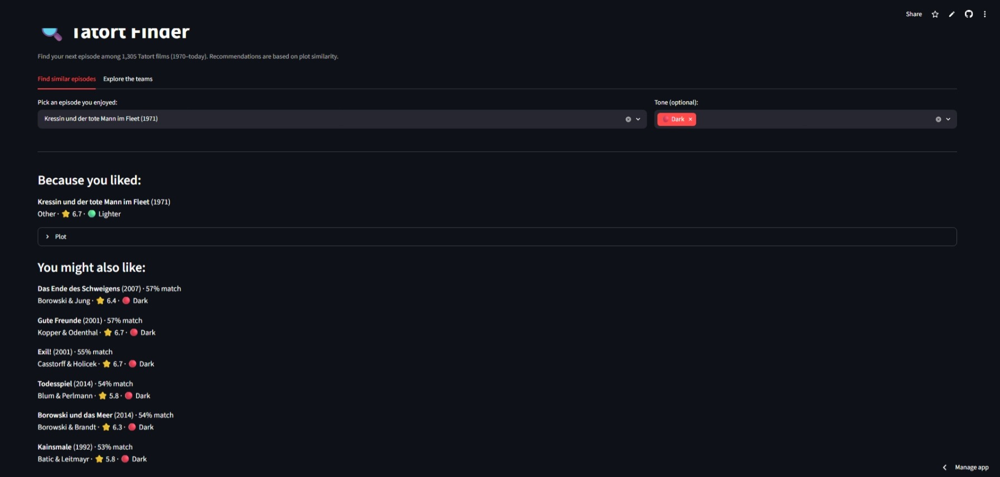
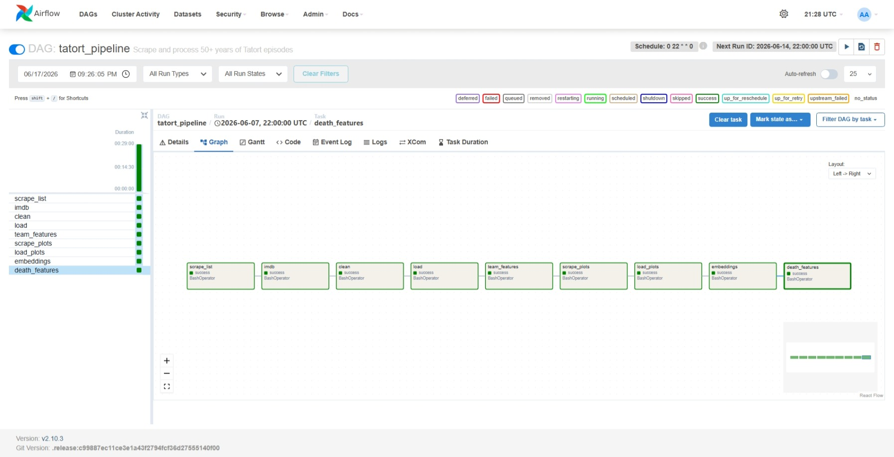

# 🔍 Tatort Finder

**A content-based recommender and analytics tool for 50+ years of _Tatort_, Germany's longest-running crime series — built as an end-to-end, orchestrated data pipeline.**

🔗 **[Live demo →](https://tatort-finder-lbcrssgd9kx2y2cdirzno4.streamlit.app/)**

> Pick a _Tatort_ episode you liked, get recommendations for similar ones — filtered by tone, browsable by detective team. Built end-to-end from public data: web scraping → multi-source entity resolution → NLP embeddings → an interactive app, all wrapped in a Dockerized pipeline orchestrated by Apache Airflow.



---

## What this is

_Tatort_ has aired ~1,340 feature-length episodes since 1970, produced by rotating regional teams (Münster, Cologne, Munich, Dresden…), each with its own detectives and tone. This project assembles a clean dataset of every episode from public sources, then uses it to answer three questions and build one tool:

1. **Can we recommend similar episodes from plot alone?** → Yes. Plot-embedding similarity powers the live app.
2. **Can we predict an episode's IMDb rating from its metadata and plot?** → Only weakly, and the plot text _doesn't_ help — a finding in itself.
3. **Can we quantify each team's "tone" (how dark/violent) from plot text?** → Partially — validated against published statistics, with honest caveats.

The deployed tool focuses on what _works for a user_: discovery by similarity and tone. The harder analytical findings live in this case study.

---

## The data pipeline

All data is free and public. Nothing is hand-collected.

| Stage           | Source                                     | Method                                      | Result                            |
| --------------- | ------------------------------------------ | ------------------------------------------- | --------------------------------- |
| Episode list    | German Wikipedia _Liste der Tatort-Folgen_ | `pandas.read_html` + cleaning               | 1,338 episodes, metadata          |
| Ratings         | IMDb non-commercial datasets               | Bulk TSV download + filter on parent series | 1,342 episodes, 1,338 rated       |
| Plot summaries  | ~1,300 individual Wikipedia articles       | Polite, resumable API scraper               | 1,305 plots (median ~3,600 chars) |
| Detective teams | Free-text `Ermittler` column               | Regex parsing + canonicalization            | 50 recurring teams                |

**Entity resolution was the hard part.** Wikipedia and IMDb share no common ID, so episodes were matched on normalized title + year, with a fuzzy-matching fallback (`thefuzz`) for spelling drift (ß↔ss, punctuation, dialect titles). Low-confidence matches were _rejected_ rather than forced, to avoid corrupting the target variable — final coverage **99.8%** (1,335/1,338), with the handful of genuine misses (IMDb-merged two-part episodes) left honestly unmatched.

The plot scraper was built to be **polite** (rate-limited), **resumable** (incremental writes, skips already-fetched episodes on restart), and **failure-tolerant** (logs missing articles instead of crashing) — it recovered a cluster of transient network errors automatically on re-run.

---

## Orchestration & infrastructure

The pipeline is **containerized with Docker** and **orchestrated with Apache Airflow**, so the whole flow runs reproducibly and on a schedule rather than as scripts run by hand.

- **Docker** — the pipeline is packaged into an image (`Dockerfile`) with data persisted via a mounted volume, so the resumable scraper never redoes work and the embedding model downloads only once. Runtime dependencies are kept separate from build/analysis dependencies to keep the image lean.
- **Airflow** — `airflow/dags/tatort_pipeline.py` defines the nine pipeline steps as tasks wired in strict dependency order (`scrape_list → imdb → clean → load → team_features → scrape_plots → load_plots → embeddings → death_features`), scheduled weekly for Sunday evenings (after each new episode airs). Every task's logs are captured and inspectable in the Airflow UI.
- **LocalExecutor by deliberate choice** — the stack uses Airflow's LocalExecutor rather than Celery + Redis. For a single-node pipeline this is the right-sized option; a Celery broker and distributed workers would be over-engineering here. (The full Celery stack was set up and then simplified once it was clear distribution added cost without benefit.)

<!-- TODO: add the DAG graph screenshot, e.g.  -->



---

## Findings

### 1. Plot premise does _not_ predict episode quality

A rating predictor was built as a controlled ablation (XGBoost, same train/test split throughout):

| Features                                 | MAE       | vs. baseline |
| ---------------------------------------- | --------- | ------------ |
| Baseline (predict the mean)              | 0.497     | —            |
| Metadata (broadcaster, year, runtime)    | 0.450     | +4.5%        |
| Metadata **+ detective team**            | **0.425** | **+14.5%**   |
| Plot embeddings only                     | 0.485     | +2.4%        |
| Metadata + team + raw embeddings         | 0.458     | _worse_      |
| Metadata + team + PCA-reduced embeddings | 0.438     | +11.9%       |

**Two real lessons:**

- The **detective team** is the single strongest predictor — a simple categorical feature beat 384-dimensional transformer embeddings.
- **Adding plot embeddings made the model worse** (classic overfitting: too many features for ~1,000 training rows). PCA reduction limited the damage but never recovered the team-only result.

The honest conclusion: _Tatort_ quality lives in execution (script, direction, acting), not in what the episode is _about_ — and that isn't visible in a plot summary. The rating predictor is therefore **deliberately excluded from the user-facing app**; the actual IMDb rating is more useful to a viewer than a worse prediction of it.

### 2. Cause-of-death detection, validated against published data

Death and cause-of-death features were extracted from plot text via pattern matching. As ground truth, the fan encyclopedia _tatort-fundus_ has hand-counted deaths across 1,000 episodes (≈2.3 per episode; most common causes: _erschossen_ > _erschlagen_ > _vergiftet_).

The first cause-detection pass got the **ordering wrong** — a greedy regex stem (`schlag`) over-matched unrelated words. After tightening to word-bounded death verbs, the detected frequency ordering **reproduced the published ranking** (_erschossen_ > _erschlagen_ > _vergiftet_) — independent validation that the extractor reads the text correctly.

### 3. "Violence intensity" is real but length-confounded — so it became "tone"

Raw death-mention counts correlated **0.45** with plot-summary length: verbose articles inflate the count regardless of actual body count. Worse, raw counts ranked the _comedic_ Münster team as highly violent — a clear artifact. Length-normalizing changed the top-5 almost entirely (1/5 overlap with the raw ranking).

Rather than overclaim a body count we can't reliably recover from prose, the measure is reframed honestly in the app as a **relative tone indicator** (🟢 Lighter / 🟡 Moderate / 🔴 Dark) — genuinely useful for "I want something not-too-grim tonight," without pretending to a precision the data doesn't support.

### 4. Embeddings fail at rating prediction but succeed at recommendation

The same plot embeddings that _hurt_ the rating model _power_ the recommender — exactly as theory predicts. Embeddings capture _what an episode is about_, which is useless for predicting quality (a great and a poor serial-killer episode are equally "about" serial killers) but precisely right for _finding similar episodes_. Cosine similarity yields coherent cross-team, cross-decade recommendations (typical similarity 0.65–0.72), and this is the engine behind the live tool.

---

## Tech stack

| Skill                 | Where it's used                                                     |
| --------------------- | ------------------------------------------------------------------- |
| **Python**            | Entire codebase                                                     |
| **Web scraping**      | Resumable Wikipedia plot scraper (`requests`, Wikipedia API)        |
| **SQL**               | DuckDB star schema, all aggregations and joins                      |
| **pandas / NumPy**    | Cleaning, feature engineering                                       |
| **Entity resolution** | Normalized + fuzzy title matching (`thefuzz`)                       |
| **NLP / embeddings**  | `sentence-transformers` (multilingual MiniLM) over German plot text |
| **ML**                | `scikit-learn`, `XGBoost`; ablation study with PCA                  |
| **Validation**        | Benchmarking extracted features against published statistics        |
| **Containerization**  | `Docker` — reproducible pipeline image + data volume                |
| **Orchestration**     | `Apache Airflow` — 9-task DAG, weekly schedule, LocalExecutor       |
| **App / deployment**  | `Streamlit`, deployed on Streamlit Community Cloud                  |
| **Tooling**           | `uv` (deps), `git`, separated build- vs. runtime requirements       |

---

## Project structure

```
tatort-platform/
├── app/streamlit_app.py          # the deployed discovery tool
├── src/tatort/
│   ├── ingestion/                # Wikipedia + IMDb scrapers
│   ├── storage/                  # cleaning, fuzzy join, DuckDB loading
│   ├── processing/               # team parsing, embeddings, death features
│   └── models/                   # rating ablation, topics, recommender, team ranking
├── run_pipeline.py               # single entrypoint; runs all steps or one named step
├── Dockerfile                    # reproducible pipeline image
├── docker-compose.yml            # pipeline + persistent data volume
├── airflow/
│   ├── Dockerfile                # Airflow image extended with pipeline deps
│   ├── docker-compose.yaml       # Airflow stack (LocalExecutor)
│   └── dags/tatort_pipeline.py   # the 9-task DAG
├── data/processed/               # DuckDB + embeddings (committed for the app)
├── requirements.txt              # lean runtime deps for deployment
└── pyproject.toml
```

To reproduce locally (plain Python):

```bash
uv sync
python run_pipeline.py            # runs the full pipeline in order
# ...or run a single step:
python run_pipeline.py embeddings
uv run streamlit run app/streamlit_app.py
```

To run the pipeline in Docker:

```bash
docker compose build
docker compose run --rm pipeline python run_pipeline.py
```

To orchestrate with Airflow:

```bash
cd airflow
docker compose up airflow-init      # one-time DB + admin user setup
docker compose up -d                # start the stack → UI at localhost:8080
# the tatort_pipeline DAG appears in the UI; trigger or let it run on schedule
```

---

## Limitations & honesty notes

- **Topic modeling was attempted and largely failed** — _Tatort_ plots are so vocabulary-similar (corpse, Kommissar, Täter…) that semantic clustering couldn't separate them cleanly; >50% landed as outliers under HDBSCAN, and forced KMeans clusters were only weakly thematic. Reported here as a genuine negative result rather than hidden.
- **The "tone" measure is relative, not a body count** — it reflects how death-focused a plot's _telling_ is, confounded ~0.45 with summary length (mitigated by normalization).
- **~35 episodes lack plot text** (no Wikipedia article or no recognizable plot section) and are excluded from embedding-based features.
- **Recommendations group at the level of tone/theme**, not fine sub-genre, due to the same plot homogeneity.

---

## Data & licensing

- Episode metadata & plot text: German Wikipedia (CC BY-SA) — attributed accordingly.
- Ratings: IMDb non-commercial datasets — used for personal/non-commercial analysis only; raw IMDb data is **not** redistributed in this repo (only derived features).
- Body-count benchmark: _tatort-fundus.de_ (used for validation/citation).

This is a non-commercial portfolio project.
